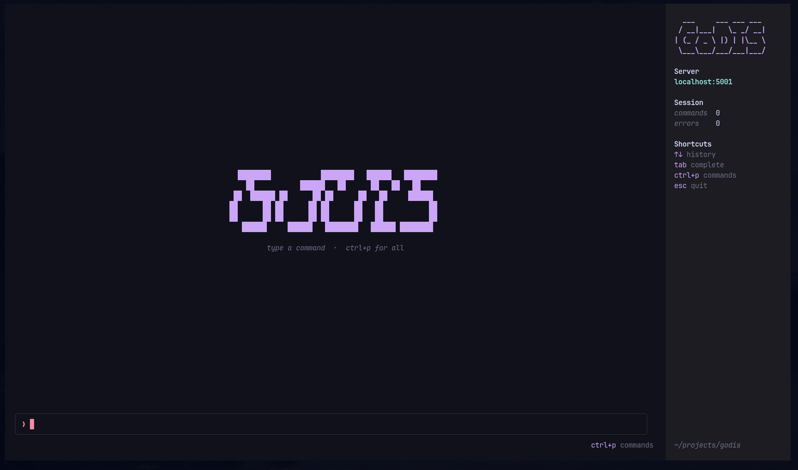

# GoDIS

A Redis clone built from scratch in Go. Implements a TCP server that speaks the Redis RESP protocol, with a built-in terminal UI client.



## Features

- TCP server listening on port `5001`
- RESP (REdis Serialization Protocol) parsing
- In-memory key-value store with persistence
- Key expiry with TTL support (lazy + active cleanup)
- Concurrent client handling via goroutines
- Data saved to `.godis/godis.json` on shutdown and every minute
- Built-in TUI client with Catppuccin Mocha theme:
  - `Ctrl+P` command palette with live search
  - Context sidebar (server, session stats, shortcuts, working dir)
  - Scrollable history (mouse wheel / PageUp-Down) with a scrollbar

## Supported Commands

| Command                 | Description                            |
| ----------------------- | -------------------------------------- |
| `SET key value [ttl]` | Store a value, optional TTL in seconds |
| `GET key`             | Retrieve a value                       |
| `DEL key`             | Delete a key                           |
| `EXISTS key`          | Check if a key exists                  |
| `TTL key`             | Get remaining time on a key            |
| `EXPIRE key seconds`  | Set or update expiry on a key          |
| `KEYS *`              | List all keys                          |

## Getting Started

**Run the server:**

```bash
make run
```

**Run the TUI client** (in a separate terminal):

```bash
make cli
```

## TUI Shortcuts

| Key                       | Action                            |
| ------------------------- | --------------------------------- |
| `Ctrl+P`                | Open command palette (searchable) |
| `↑` / `↓`           | Navigate command history          |
| `Tab`                   | Autocomplete command              |
| `Mouse wheel`           | Scroll the history panel          |
| `PageUp` / `PageDown` | Scroll history a page             |
| `Ctrl+U` / `Ctrl+D`   | Scroll history half a page        |
| `Ctrl+L` or `CLEAR`   | Clear screen                      |
| `Ctrl+Backspace`        | Delete last word                  |
| `ESC`                   | Quit                              |

## Project Structure

```
godis/
├── main.go          # Server, connection handling, message routing
├── peer.go          # Per-client connection and RESP reading
├── protocol.go      # RESP command parsing
├── keyval.go        # In-memory key-value store
├── client/
│   └── client.go    # Go client library
├── tui/
│   └── tui.go       # Terminal UI (Bubble Tea + Lipgloss)
└── cmd/cli/
    └── main.go      # TUI client entry point
```

## Built With

- [tidwall/resp](https://github.com/tidwall/resp) — RESP protocol parsing
- [charmbracelet/bubbletea](https://github.com/charmbracelet/bubbletea) — TUI framework
- [charmbracelet/lipgloss](https://github.com/charmbracelet/lipgloss) — TUI styling
- [superstarryeyes/bit](https://github.com/superstarryeyes/bit) — ANSI font rendering for the logo

---

by TWAHaaa
